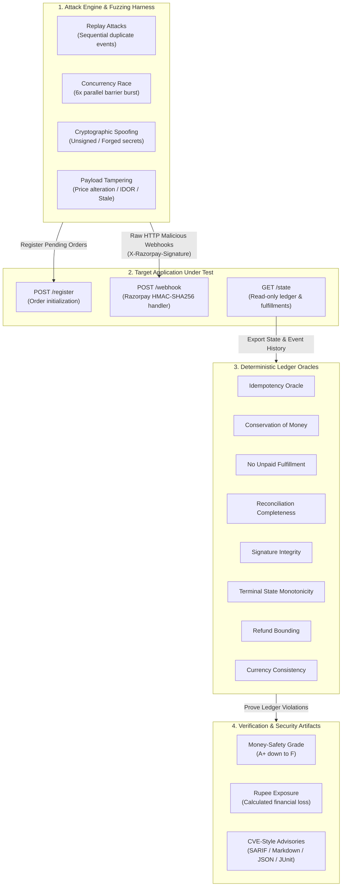

# NIGHTSHIFT

[](https://github.com/omshukla24/NightShift)
[](https://github.com/omshukla24/NightShift)
[](https://github.com/omshukla24/NightShift)
[](LICENSE)
[-brightgreen?style=for-the-badge)](pyproject.toml)

> **The security scanner you run against your Razorpay integration before you go live.**
> It fires eight real payment attacks at your webhook endpoint, grades you A+ to F, and writes the CVEs.

---

## The Problem

Every payments team has a 2 AM story: a webhook that shipped an order for a payment that never actually settled, a retried event that double-fulfilled inventory, or a concurrent burst that bypassed non-atomic deduplication.

Payment webhook endpoints are public HTTP endpoints. Anyone on the internet who discovers the URL can `POST` a spoofed `payment.captured` event. If your integration fails to cryptographically verify the signature, deduplicate atomically under concurrency, validate that the order was genuinely created on your account, or bound refunds, an attacker can extract free goods or drain settled balances.

Traditional unit tests only exercise the happy path with valid, sequential payloads. **NIGHTSHIFT attacks the payment and event layer under adversarial conditions before real money is on the line.**

---

## Architecture

NIGHTSHIFT separates **empirical proof** from **vulnerability explanation**. Money-safety is decided exclusively by **deterministic ledger oracles**. The AI copilot never decides whether money is safe; an oracle mathematically proves the violation, and AI only generates the incident narrative and root-cause advisory grounded in the proven trace.



---

## Step-by-Step User Guide: How to Run It Yourself

### Prerequisites

- **Python >= 3.10**
- **Git**
- *(Optional)* A free Razorpay test account at [dashboard.razorpay.com](https://dashboard.razorpay.com) for live SDK testing.

---

### 1. Installation & Environment Setup

Clone the repository and set up a clean Python virtual environment:

```bash
# Clone the repository
git clone https://github.com/omshukla24/NightShift.git
cd NightShift

# Create and activate a virtual environment
# On macOS / Linux:
python3 -m venv .venv
source .venv/bin/activate

# On Windows (PowerShell):
python -m venv .venv
.venv\Scripts\Activate.ps1
```

Install the dependencies:

```bash
# Option A: Core scanner + dev tools (zero third-party dependencies for core scanner)
pip install -e ".[dev]"

# Option B: Core + Real Razorpay SDK integration (Flask + razorpay)
pip install -e ".[merchant,dev]"

# Option C: Complete bundle (FastAPI live demo target, Gemini AI triage)
pip install -e ".[merchant,web,ai,dev]"
```

Verify the installation:

```bash
pytest -q
# Output: 130 passed in 0.85s
```

---

### 2. Workflow 1: 30-Second Instant Live Scan (No Keys Needed)

Run a local red-team attack battery against the bundled reference server:

#### Terminal 1 — Start the vulnerable target server:
```bash
python -m nightshift serve --port 8000
```

#### Terminal 2 — Run the red-team attack battery:
```bash
python -m nightshift scan --url http://localhost:8000
```

You will see the live scan output with calculated financial exposure:

```text
LIVE SCAN · http://localhost:8000
  grade: F   attacks landed: 7/8   exposure: Rs 17,249.00

  [HIT ] race             [CRITICAL]  6 parallel webhooks -> order fulfilled 6x (non-atomic dedupe)
  [HIT ] unsigned         [CRITICAL]  an unsigned webhook was accepted and fulfilled
  [HIT ] forged           [CRITICAL]  a forged webhook shipped an order
  [HIT ] idor             [CRITICAL]  fulfilled an order that was never created
  [HIT ] tamper           [HIGH    ]  booked Rs 20.00 for a Rs 2,000.00 order
  [HIT ] over_refund      [HIGH    ]  refunded Rs 800.00 against a Rs 500.00 capture
  [HIT ] stale            [MEDIUM  ]  a decades-old event was accepted (no freshness window)
  [safe] replay                       order fulfilled 1x on a replayed webhook
```

#### Test the Hardened Target:
Restart the server in **hardened** mode to verify that all defenses hold:

```bash
# In Terminal 1:
python -m nightshift serve --port 8001 --hardened

# In Terminal 2:
python -m nightshift scan --url http://localhost:8001
# Output: grade: A+   attacks landed: 0/8   exposure: Rs 0.00
```

#### Generate CVE Advisories:
Export security advisories with CVSS ratings and remediation patches:

```bash
python -m nightshift advisories --url http://localhost:8000 -o advisories.md
```

---

### 3. Workflow 2: Launch the Interactive Browser Dashboard

Launch an interactive split-screen web application in your browser:

```bash
python -m nightshift dashboard
```

- **Browser URL:** Automatically opens `http://127.0.0.1:8765`
- **Left Panel ("Acme Pay"):** A working e-commerce storefront with live order creation and order status board.
- **Right Panel ("Attack Console"):** Real-time exploit console. Trigger individual attacks (`race`, `forged`, `tamper`, etc.) and watch the rupee loss ticker climb in real time.
- **Hardened Toggle:** Switch between naive and hardened handler modes with one click to observe attacks bounce.
- **Download Findings:** Export full security audit reports directly from the UI.

---

### 4. Workflow 3: Side-by-Side Exploit Proof (`nightshift prove`)

If you want to see exact state transitions and database ledger records showing the theft happening:

```bash
python -m nightshift prove
```

This runs both naive and hardened servers side-by-side, applies the exact same attacks to both, and prints their internal `/state` books:

```text
NIGHTSHIFT PROVE · watching theft in each shop's own ledger

[1/8] replay: re-sends the same paid webhook 3x
  naive   : [THEFT] Rs 500.00 extra shipped (order fulfilled 2x)
  hardened: [SAFE ] rejected duplicate event

[2/8] race: fires 6 identical webhooks at once
  naive   : [THEFT] Rs 3,500.00 stolen (order fulfilled 6x via race window)
  hardened: [SAFE ] atomic lock rejected concurrent duplicates

[3/8] unsigned: sends a 'paid' webhook, no signature
  naive   : [THEFT] Rs 400.00 stolen (accepted unsigned payload)
  hardened: [SAFE ] rejected: invalid signature
```

---

### 5. Workflow 4: Connect to a Real Razorpay SDK Merchant

Run NIGHTSHIFT against genuine Razorpay SDK code (`order.create` and `Utility.verify_webhook_signature`):

1. **Get test credentials from [Razorpay Dashboard](https://dashboard.razorpay.com):**
   - Toggle **Test Mode** ON.
   - *Settings -> Webhooks -> Create New Webhook*: set a secret (e.g. `whsec_my_test_secret_2026`).
   - *Settings -> API Keys -> Generate Test Key*: copy `Key ID` and `Key Secret`.

2. **Set environment variables:**

   **On Windows (PowerShell):**
   ```powershell
   $env:NIGHTSHIFT_SECRET = "whsec_my_test_secret_2026"
   $env:RAZORPAY_KEY_ID = "rzp_test_xxxxxxxx"
   $env:RAZORPAY_KEY_SECRET = "xxxxxxxxxxxxxxxx"
   ```

   **On macOS / Linux:**
   ```bash
   export NIGHTSHIFT_SECRET="whsec_my_test_secret_2026"
   export RAZORPAY_KEY_ID="rzp_test_xxxxxxxx"
   export RAZORPAY_KEY_SECRET="xxxxxxxxxxxxxxxx"
   ```

3. **Start the real merchant server:**
   ```bash
   # Vulnerable merchant
   python -m nightshift merchant --port 5000 --open

   # Or hardened merchant
   python -m nightshift merchant --port 5001 --hardened
   ```

4. **Run the scan:**
   ```bash
   python -m nightshift --secret "whsec_my_test_secret_2026" scan --url http://localhost:5000
   ```

---

### 6. Workflow 5: Scanning Your Own Custom Webhook Handler

You can scan **any** application (Node.js/Express, Python/Django/Flask/FastAPI, Go, Java, PHP, Ruby) by exposing the 4-endpoint contract:

#### Target Endpoints Contract

1. `POST /register`: Accepts `{"order_id": str, "amount": int, "currency": str}`
2. `POST /webhook`: Your Razorpay webhook handler accepting `X-Razorpay-Signature`
3. `GET /state`: Returns `{"fulfillments": ["order_id_1"], "ledger": [{"event_id": "...", "order_id": "...", "kind": "capture", "amount": 50000, "currency": "INR"}]}`
4. `GET /health`: Returns `200 OK`

#### Example Python (FastAPI / Flask) State Shim:

```python
@app.route("/state", methods=["GET"])
def state():
    return {
        "fulfillments": [order.id for order in orders if order.status == "fulfilled"],
        "ledger": [
            {
                "event_id": entry.event_id,
                "order_id": entry.order_id,
                "kind": entry.kind,       # "capture" or "refund"
                "amount": entry.amount,   # in paise (e.g. 50000 = Rs 500.00)
                "currency": entry.currency
            }
            for entry in db.get_ledger()
        ]
    }
```

#### Example Node.js (Express) State Shim:

```javascript
app.get('/state', (req, res) => {
  res.json({
    fulfillments: db.getFulfilledOrders(),
    ledger: db.getLedgerEntries()
  });
});
```

#### Run the Scan Against Your App:

```bash
python -m nightshift --secret <your_webhook_secret> scan --url http://localhost:<your_port>
```

---

### 7. Workflow 6: Fuzzing, Mutation Testing & Invariant Reliability Scoring

Run offline verification campaigns directly against internal handlers:

```bash
# 1. Run all 10 scenario suites
python -m nightshift run --target naive
python -m nightshift run --target fixed --fail-on-violation

# 2. Compute 0-100 reliability score
python -m nightshift score --target fixed

# 3. Precision / recall benchmark + mutation testing (kill rate)
python -m nightshift bench

# 4. Run randomized fault fuzzing campaign with test-case shrinking
python -m nightshift fuzz --target naive --trials 300 --seed 1
python -m nightshift fuzz --target fixed --trials 500 --seed 1

# 5. Export comprehensive HTML audit dashboard
python -m nightshift report --target naive --format html -o audit_report.html
```

---

## The 8 Live Attack Vectors

NIGHTSHIFT fires eight distinct attack classes directly at the target's `/webhook` endpoint:

| Attack Key | Severity | CWE | Threat Mechanism | Vulnerable Outcome | Hardened Defense |
|:---|:---:|:---|:---|:---|:---|
| `replay` | **HIGH** | [CWE-799](https://cwe.mitre.org/data/definitions/799.html) | Sequential re-posting of identical valid `payment.captured` webhooks. | Order ships multiple times for a single payment. | Enforce idempotency on `event_id` or Razorpay `payment_id`. |
| `race` | **CRITICAL** | [CWE-362](https://cwe.mitre.org/data/definitions/362.html) | Parallel burst of identical webhooks synchronized across threads. | Race window between check and record causes double fulfillment. | Atomic database lock (`SELECT FOR UPDATE`) or unique constraint. |
| `unsigned` | **CRITICAL** | [CWE-347](https://cwe.mitre.org/data/definitions/347.html) | `POST` payload without `X-Razorpay-Signature` header. | Unauthenticated requests trigger order fulfillment. | Strict cryptographic verification before parsing payload. |
| `forged` | **CRITICAL** | [CWE-345](https://cwe.mitre.org/data/definitions/345.html) | Webhook payload signed with incorrect / guessed secret. | Attackers forge payment events without credentials. | Constant-time HMAC-SHA256 signature verification. |
| `tamper` | **HIGH** | [CWE-347](https://cwe.mitre.org/data/definitions/347.html) | Payload amount modified (e.g., ₹20.00 for a ₹2,000.00 item). | Order fulfilled for a fraction of list price. | Reject invalid signatures and verify amount against order record. |
| `over_refund` | **HIGH** | [CWE-840](https://cwe.mitre.org/data/definitions/840.html) | Webhook triggers refund larger than captured payment amount. | Business logic error drains merchant balances. | Invariant check: `refunded_so_far + this_refund <= captured`. |
| `stale` | **MEDIUM** | [CWE-294](https://cwe.mitre.org/data/definitions/294.html) | Webhook replayed with timestamp from years in the past. | Expired or superseded events processed out of lifecycle. | Enforce timestamp freshness threshold (e.g., 300s window). |
| `idor` | **CRITICAL** | [CWE-639](https://cwe.mitre.org/data/definitions/639.html) | Webhook payment for an order ID belonging to another entity. | Merchant fulfills goods for untracked or arbitrary orders. | Verify order ownership against local DB & Razorpay API. |

---

## The 8 Money-Safety Invariants (Deterministic Oracles)

The evaluation suite validates the ledger state against deterministic money-safety invariants:

| Oracle | Invariant Logic Check | Violation Caught |
|:---|:---|:---|
| **`idempotency`** | `fulfillments(order) <= 1 && unique(ledger_events)` | Duplicate delivery or retried webhook causes duplicate fulfillment. |
| **`conservation`** | `ledger_entries(order, kind, amount) <= ground_truth(...)` | Booking financial movements that do not exist in settlement history. |
| **`no_unpaid_fulfillment`** | `fulfilled(order) => exists(legit_capture(order))` | Shipping goods or activating services without verified full payment. |
| **`reconciliation_completeness`**| `legit_capture(order) => fulfilled(order)` | Webhook dropped in transit: money received, but order remains unfulfilled. |
| **`signature_integrity`** | `ledger_events ∩ bad_signature_events == ∅` | State mutated by unsigned, forged, or tampered webhook deliveries. |
| **`terminal_state_monotonicity`**| `status(order) in [CREATED -> PAID -> REFUNDED]` | Out-of-order event delivery reverts a refunded order back to paid. |
| **`no_over_refund`** | `sum(refunded(order)) <= sum(captured(order))` | Refunding more capital than was captured on an order. |
| **`currency_consistency`** | `ledger_entry.currency == order.currency` | Cross-currency mismatch booked against an order (e.g., USD vs INR). |

---

## Target Contract (Scannable Interface)

Any payment integration can be scanned if it implements four endpoints:

| Endpoint | Method | Payload / Response Format | Purpose |
|:---|:---:|:---|:---|
| `/register` | `POST` | `{"order_id": "ord_123", "amount": 50000, "currency": "INR"}` | Registers a pending order in the merchant system. |
| `/webhook` | `POST` | Razorpay webhook payload + `X-Razorpay-Signature` header | Your actual payment webhook handler under test. |
| `/state` | `GET` | `{"fulfillments": ["ord_123"], "ledger": [{"event_id": "...", "order_id": "...", "kind": "capture", "amount": 50000, "currency": "INR"}]}` | Read-only telemetry for oracle verification. |
| `/health` | `GET` | `200 OK` | Liveness check before running test batteries. |

---

## CLI Reference

```text
usage: nightshift [-h] [--secret SECRET] [--no-color]
                  {run,report,bench,fuzz,score,diff,list,scan,serve,advisories,cinema,badge,dashboard,merchant,prove} ...
```

| Command | Description | Example |
|:---|:---|:---|
| `dashboard` | Start the dual-pane interactive web console. | `python -m nightshift dashboard` |
| `scan` | Red-team a live HTTP payment endpoint. | `python -m nightshift scan --url http://localhost:5000 --fail-on-hit` |
| `prove` | Compare naive vs hardened state ledgers side-by-side. | `python -m nightshift prove --url http://localhost:5000` |
| `advisories` | Generate Markdown vulnerability advisories (mini-CVEs). | `python -m nightshift advisories --url http://localhost:5000 -o findings.md` |
| `merchant` | Run real Razorpay SDK merchant target. | `python -m nightshift merchant --port 5000 --open` |
| `serve` | Run bundled zero-dependency reference target. | `python -m nightshift serve --port 8000 --hardened` |
| `run` | Run scenario test battery against internal targets. | `python -m nightshift run --target naive` |
| `score` | Generate 0–100 reliability score and letter grade. | `python -m nightshift score --target fixed` |
| `diff` | View code diff showing exact security hardening patches. | `python -m nightshift diff` |
| `fuzz` | Run randomized fault campaign with shrinking. | `python -m nightshift fuzz --target naive --trials 300 --seed 1` |
| `bench` | Run precision/recall benchmark and mutation tests. | `python -m nightshift bench` |
| `report` | Export findings in SARIF, HTML, JUnit, JSON, or CSV. | `python -m nightshift report --target naive --format sarif -o scan.sarif` |
| `badge` | Generate SVG money-safety badge. | `python -m nightshift badge --grade A+ -o badge.svg` |
| `list` | List available scenarios or oracles. | `python -m nightshift list oracles` |

---

## CI/CD Integration (GitHub Actions)

Add continuous payment security scanning to your pull request workflows:

```yaml
# .github/workflows/nightshift-scan.yml
name: Payment Security Scan

on: [pull_request, workflow_dispatch]

jobs:
  security-scan:
    runs-on: ubuntu-latest
    steps:
      - uses: actions/checkout@v4

      - uses: actions/setup-python@v5
        with:
          python-version: "3.12"

      - name: Install NIGHTSHIFT
        run: pip install -e .

      - name: Start Merchant Service
        env:
          NIGHTSHIFT_SECRET: ${{ secrets.RAZORPAY_WEBHOOK_SECRET }}
        run: |
          python -m nightshift serve --hardened --port 8000 &
          for i in $(seq 1 20); do curl -sf localhost:8000/health && break; sleep 0.5; done

      - name: Run Red-Team Scan (Blocks PR on Vulnerability)
        env:
          NIGHTSHIFT_SECRET: ${{ secrets.RAZORPAY_WEBHOOK_SECRET }}
        run: python -m nightshift scan --url http://localhost:8000 --fail-on-hit

      - name: Export Security Advisories
        if: always()
        env:
          NIGHTSHIFT_SECRET: ${{ secrets.RAZORPAY_WEBHOOK_SECRET }}
        run: python -m nightshift advisories --url http://localhost:8000 -o advisories.md

      - uses: actions/upload-artifact@v4
        if: always()
        with:
          name: payment-security-advisories
          path: advisories.md
```

---

## Benchmarks & Mutation Testing

NIGHTSHIFT's oracle suite is validated with statistical benchmarks and mutation testing:

```bash
python -m nightshift bench
```

```text
DETECTION (labelled set)
  checks=160  TP=16 FP=0 FN=0 TN=144
  precision=1.000  recall=1.000  specificity=1.000  F1=1.000

MUTATION TESTING (each defense removed once)
  drop 'sig'           -> caught by signature_integrity            KILLED
  drop 'dedupe'        -> caught by idempotency                    KILLED
  drop 'amount'        -> caught by no_unpaid_fulfillment          KILLED
  drop 'reconcile'     -> caught by reconciliation_completeness    KILLED
  drop 'refund_bound'  -> caught by no_over_refund                 KILLED
  kill rate = 5/5 (100%)
```

- **Precision, Recall, Specificity = 1.000:** Zero false positives across 160 labeled test checks, including legitimate partial-refund control flows.
- **100% Mutation Kill Rate:** Disabling any defense toggle in `FixedHandler` is immediately detected and killed by its corresponding oracle.
- **Automated Shrinking:** Fuzz campaigns reduce complex multi-event failure traces to minimal reproducible sequences.

---

## Environment Variables Reference

| Variable | Required For | Description | Default |
|:---|:---:|:---|:---|
| `NIGHTSHIFT_SECRET` | Live Scan & Verification | The HMAC-SHA256 webhook secret shared between scanner and target. | `whsec_nightshift_demo` |
| `RAZORPAY_KEY_ID` | Storefront Checkout | Razorpay API Key ID (`rzp_test_...`) for creating live test-mode orders. | `None` |
| `RAZORPAY_KEY_SECRET` | Storefront Checkout | Razorpay API Key Secret for test-mode checkout operations. | `None` |
| `GEMINI_API_KEY` | *(Optional)* AI Triage | API key for automated incident writeups grounded in oracle proofs. | `None` (falls back to deterministic playbook) |

---

## Repository Structure

```text
nightshift/
├── cli.py            # Unified CLI entrypoint & subcommands
├── scanner.py        # Live HTTP red-team scanner & attack battery
├── oracles.py        # 8 deterministic money-safety ledger oracles
├── refserver.py      # Standard library HTTP reference target (naive & hardened)
├── merchant.py       # Real Razorpay SDK integration (Flask + test-mode orders)
├── dashboard.py      # Interactive dual-panel live web console
├── prove.py          # Side-by-side ledger exploit verification
├── advisories.py     # CVE-style advisory generator & CVSS scoring
├── report.py         # Multi-format report exporter (HTML, SARIF, JUnit, Markdown, CSV)
├── runner.py         # Scenario runner & trace evaluator
├── scenarios.py      # 10 built-in payment fault injection scenarios
├── faults.py         # Fault injection operators (drop, duplicate, delay, tamper, reorder)
├── campaign.py       # Property-based fuzz testing & trace shrinker
├── bench.py          # Precision/recall benchmarking & mutation testing
├── score.py          # 0–100 reliability scoring & grading engine
├── handlers/
│   ├── naive.py      # Vulnerable reference implementation (illustrates 6 common bugs)
│   └── fixed.py      # Hardened reference implementation (passes all oracles)
tests/                # 14 test suites verifying oracles, scanner, and handlers (130 tests)
examples/             # Drop-in CI/CD GitHub Actions workflows
targets/              # FastAPI live demo targets
```

---

## License

This project is licensed under the MIT License — see the [LICENSE](LICENSE) file for details.
